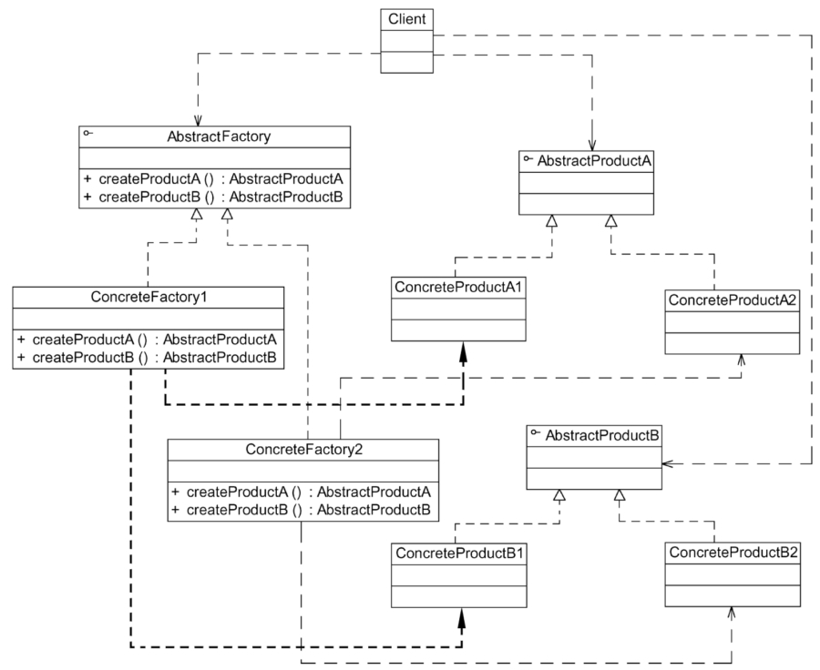

#### **抽象工厂模式：**

##### 1、概述

提供一个创建一系列相关或相互依赖对象的接口，而无需指定它们具体的类。

工厂模式就相当于创建实例对象的new，我们经常要根据类Class生成实例对象，如A a=new A()
工厂模式也是用来创建实例对象的，所以以后new时就要多个心眼，是否可以考虑实用工厂模式。

##### 2、适用性

a、一个系统要独立于它的产品的创建、组合和表示时。
b、一个系统要由多个产品系列中的一个来配置时。
c、当你要强调一系列相关的产品对象的设计以便进行联合使用时。
d、当你提供一个产品类库，而只想显示它们的接口而不是实现时。

##### 3、参与者

a、AbstractFactory （抽象工厂）：声明了一组用于创建一族产品的方法，每个方法对应一种产品。
b、ConcreteFactory （具体工厂）：实现创建具体产品对象的操作。
c、AbstractProduct （抽象产品）：为每种产品声明接口，在抽象产品中声明了产品所具有的业务方法。
d、ConcreteProduct （具体产品）：定义一个将被相应的具体工厂创建的产品对象， 实现在抽象产品接口中声明的业务方法。

