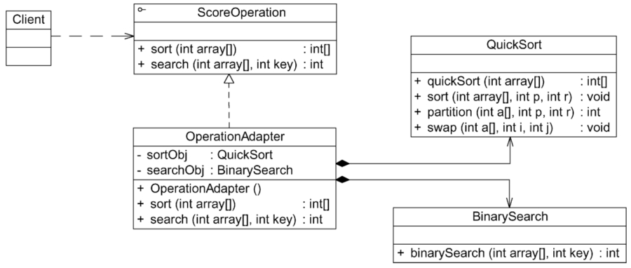

#### **适配器模式：**

##### 1、概述

将一个类的接口转换成客户希望的另外一个接口。Adapter模式使得原本由于接口不兼容而不能一起工
作的那些类可以一起工作。

##### 2、适用性

a、使用一个已经存在的类，而它的接口不符合你的需求。
b、创建一个可以复用的类，该类可以与其他不相关的类或不可预见的类（即那些接口 可能不一定兼
容的类）协同工作。
c、（仅适用于对象Adapter）使用一些已经存在的子类，但是不可能对每一个都进行 子类化以匹配它
们的接口。对象适配器可以适配它的父类接口。

##### 3、参与者

a、Target（目标抽象类）：目标抽象类定义客户所需接口，可以是一个抽象类或接口，也可以是具体类。
b、Adapter（适配器类）：适配器可以调用另一个接口，作为一个转换器，对Adaptee和Target进行适配。
c、Adaptee（适配者类）：适配者即被适配的角色，它定义了一个已经存在的接口，这个接口需要适配。

##### 4、类图

