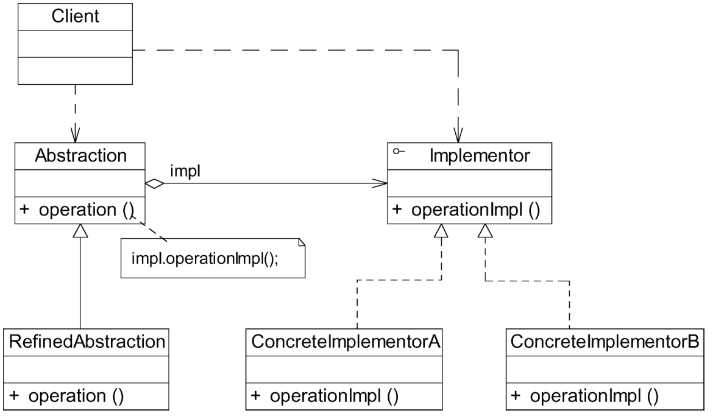

#### **桥接模式：**

##### 1、概述

将抽象部分与它的实现部分分离，使它们都可以独立地变化。

##### 2、适用性

a、如果一个系统需要在抽象类和具体类之间增加更多的灵活性，避免在两个层次之间建立静态的继承关系，通过桥接模式可以使它们在抽象层建立一个关联关系。
b、抽象部分和实现部分可以以继承的方式独立扩展而互不影响，在程序运行时可以动态地将一个抽象类子类的对象和一个实现类子类的对象进行组合。
c、一个类存在两个（或多个）独立变化的维度，且这两个（或多个）维度都需要独立进行扩展。
d、对于那些不希望使用继承或因为多层继承导致系统类的个数急剧增加的系统，桥接模式尤为适用。

##### 3、参与者

a、Abstraction（抽象类）：用于定义抽象类的接口，它一般是抽象类而不是接口，其中定义了一个Implementor（实现类接口）类型的对象并可以维护该对象。
b、RefinedAbstraction（扩充抽象类）：扩充由Abstraction定义的接口，通常情况下它不再是抽象类而是具体类。
c、Implementor（实现类接口）：定义实现类的接口，这个接口不一定要与Abstraction的接口完全一致，事实上这两个接口可以完全不同。一般而言，Implementor接口仅提供基本操作，而Abstraction定义的接口可能会做更多、更复杂的操作。
d、ConcreteImplementor（具体实现类）：具体实现Implementor接口，在不同的ConcreteImplementor中提供基本操作的不同实现。

