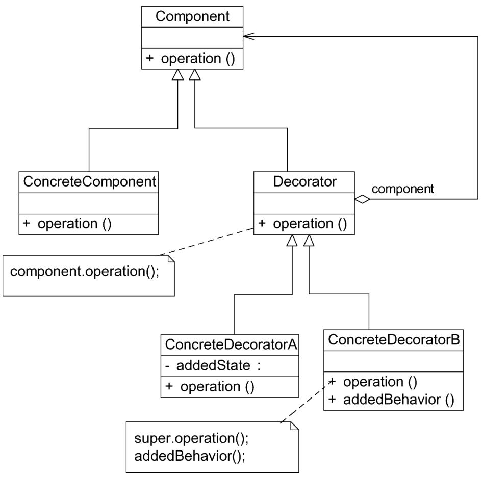

#### **装饰模式：**

##### 1、概述

动态地给一个对象增加一些额外的职责，就增加对象功能来说，装饰模式比生成子类实现更为灵活。

##### 2、适用性

a、在不影响其他对象的情况下，以动态、透明的方式给单个对象添加职责。
b、当不能采用继承的方式对系统进行扩展或者采用继承不利于系统扩展和维护时可以使用装饰模式。不能采用继承的情况主要有两类：第1类是系统中存在大量独立的扩展，为支持每一种扩展或者扩展之间的组合将产生大量的子类，使得子类数目呈爆炸性增长；第2类是因为类已定义为不能被继承（如Java语言中的final类）。

Java SE中的AWT和Swing包的设计就基于组合模式

##### 3、参与者

a、Component（抽象构件）：是具体构件和抽象装饰类的共同父类，声明了在具体构件中实现的业务方法。
b、ConcreteComponent（具体构件）：是抽象构件类的子类，用于定义具体的构件对象，实现了在抽象构件中声明的方法，装饰器可以给它增加额外的职责（方法）。
c、Decorator（抽象装饰类）：也是抽象构件类的子类，用于给具体构件增加职责，但是具体职责在其子类中实现。
d、ConcreteDecorator（具体装饰类）：它是抽象装饰类的子类，负责向构件添加新的职责。每一个具体装饰类都定义了一些新的行为，可以调用在抽象装饰类中定义的方法，并可以增加新的方法用以扩充对象的行为。

##### 4、透明装饰模式与半透明装饰模式

1、透明装饰模式：在透明装饰模式中，要求客户端完全针对抽象编程。装饰模式的透明性要求客户端程序不应该将对象声明为具体构件类型或具体装饰类型，而应该全部声明为抽象构件类型。

2．对于客户端而言，具体构件类型无须关心，是透明的；但是具体装饰类型必须指定，这是不透明的。
