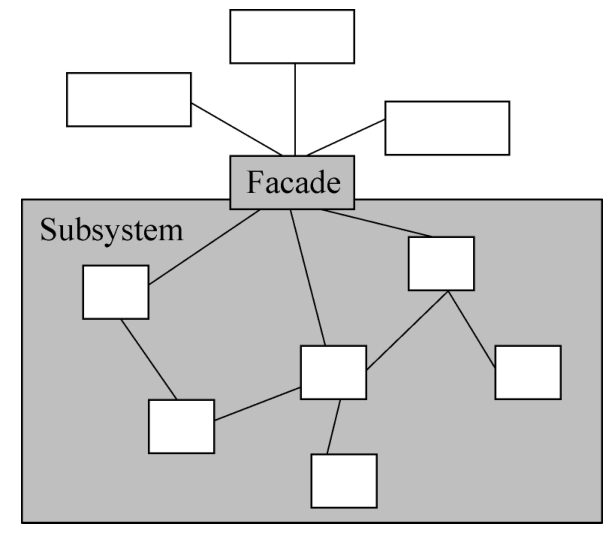
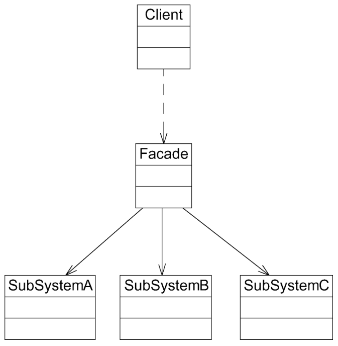

#### **外观模式：**

##### 1、概述

外部与一个子系统的通信通过一个统一的外观角色进行，为子系统中的一组接口提供一个一致的入口。外观模式定义了一个高层接口，这个接口使得子系统更加容易使用。外观模式又称为门面模式，它是一种对象结构型模式。

##### 2、适用性

a、当要为访问一系列复杂的子系统提供一个简单入口时可以使用外观模式。
b、客户端程序与多个子系统之间存在很大的依赖性。引入外观类可以将子系统与客户端解耦，从而提高子系统的独立性和可移植性。
c、在层次化结构中，可以使用外观模式定义系统中每一层的入口，层与层之间不直接产生联系，而通过外观类建立联系，降低层之间的耦合度。

##### 3、参与者

a、Facade（外观角色）：在客户端可以调用这个角色的方法，在外观角色中可以知道相关的（一个或者多个）子系统的功能和责任。在正常情况下，它将所有从客户端发来的请求委派到相应的子系统中去，传递给相应的子系统对象处理。
b、SubSystem（子系统角色）：在软件系统中可以有一个或者多个子系统角色。

4、补充：

a、在很多情况下为了节约系统资源，系统中只需要一个外观类的实例。换言之，外观类可以是一个单例类。因此可以通过单例模式来设计外观类，从而确保系统中只有唯一一个访问子系统的入口，并降低对系统资源的消耗。

b、在很多情况下为了节约系统资源，系统中只需要一个外观类的实例。换言之，外观类可以是一个单例类。因此可以通过单例模式来设计外观类，从而确保系统中只有唯一一个访问子系统的入口，并降低对系统资源的消耗。

c、试图通过外观类为子系统增加新行为的做法是错误的。外观模式的用意是为子系统提供一个集中化和简化的沟通渠道，而不是向子系统加入新行为。新行为的增加应该通过修改原有子系统类或增加新的子系统类来实现，不能通过外观类来实现。
