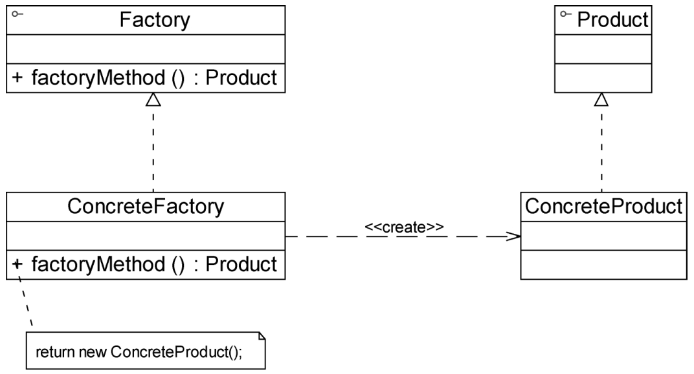

#### **工厂方法模式：**

##### 1、概述

定义一个用于创建对象的接口，让子类决定实例化哪一个类。FactoryMethod使一个类的实例化延迟到
其子类。

##### 2、适用性

a、当一个类不知道它所必须创建的对象的类的时候。
b、当一个类希望由它的子类来指定它所创建的对象的时候。
c、当类将创建对象的职责委托给多个帮助子类中的某一个，并且你希望将哪一个帮助子类是代理者这一信息局部化的时候。

##### 3、参与者

a、Product （抽象产品）：定义产品的接口，工厂方法所创建的对象的接口。
b、ConcreteProduct （具体产品）：实现了抽象产品接口，某种类型的具体产品由专门的具体工厂创建。
c、Factory（抽象工厂）：声明工厂方法，该方法返回一个Product类型的对象。 Factory也可以定义一个工厂方法的缺省实现，它返回一个缺省的ConcreteFactory 对象。 可以调用工厂方法以创建一个Product对象。
d、ConcreteFactory （具体工厂）：抽象工厂类的子类，实现了抽象工厂中定义的工厂方法，并可由客户端调用，返回一个具体产品类的实例。

