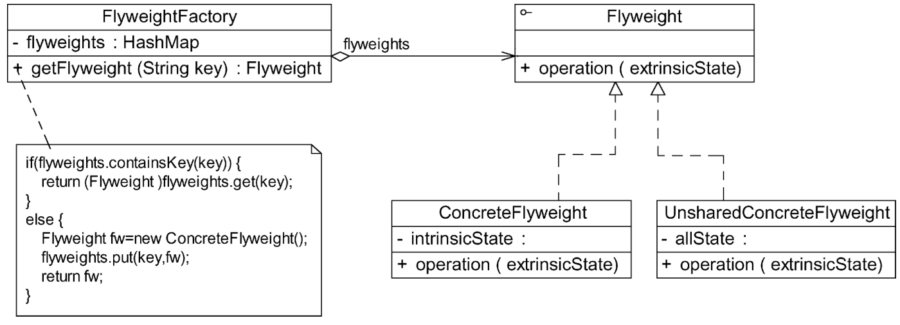
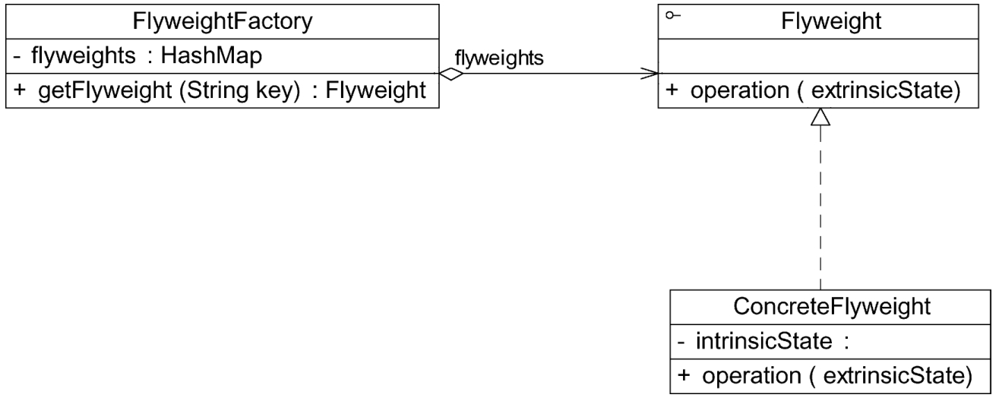
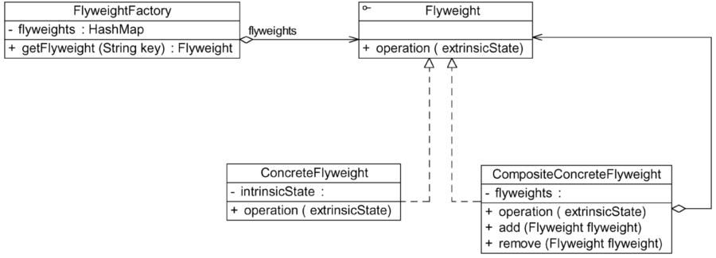

#### **享元模式：**

##### 1、概述

运用共享技术有效地支持大量细粒度对象的复用。

##### 2、适用性

a、一个系统有大量相同或者相似的对象，造成内存的大量耗费。
b、一个系统有大量相同或者相似的对象，造成内存的大量耗费。
c、在使用享元模式时需要维护一个存储享元对象的享元池，而这需要耗费一定的系统资源。因此，在需要多次重复使用同一享元对象时才值得使用享元模式。

##### 3、参与者

a、Flyweight（抽象享元类）：通常是一个接口或抽象类，在抽象享元类中声明了具体享元类公共的方法，这些方法可以向外界提供享元对象的内部数据（内部状态），同时也可以通过这些方法来设置外部数据（外部状态）。
b、ConcreteFlyweight（具体享元类）：它实现了抽象享元类，其实例称为享元对象。在具体享元类中为内部状态提供了存储空间。通常，可以结合单例模式来设计具体享元类，为每个具体享元类提供唯一的享元对象。
c、ConcreteFlyweight（具体享元类）：它实现了抽象享元类，其实例称为享元对象。在具体享元类中为内部状态提供了存储空间。通常，可以结合单例模式来设计具体享元类，为每个具体享元类提供唯一的享元对象。
d、FlyweightFactory（享元工厂类）：享元工厂类用于创建并管理享元对象，它针对抽象享元类编程，将各种类型的具体享元对象存储在一个享元池中。

##### 4、享元对象能做到共享的关键是区分了内部状态（Intrinsic State）和外部状态（Extrinsic State）

a、内部状态是存储在享元对象内部并且不会随环境改变而改变的状态，内部状态可以共享。
b、外部状态是随环境改变而改变的、不可以共享的状态。享元对象的外部状态通常由客户端保存，并在享元对象被创建之后，需要使用的时候，再传入享元对象内部。

**5、单纯享元模式和复合享元模式**

a、单纯享元模式：在单纯享元模式中，所有的具体享元类都是可以共享的，不存在非共享具体享元类。

b、复合享元模式：将一些单纯享元对象使用组合模式加以组合，还可以形成复合享元对象。这样的复合享元对象本身不能共享，但是它们可以包括单纯享元对象，而后者则可以共享。

