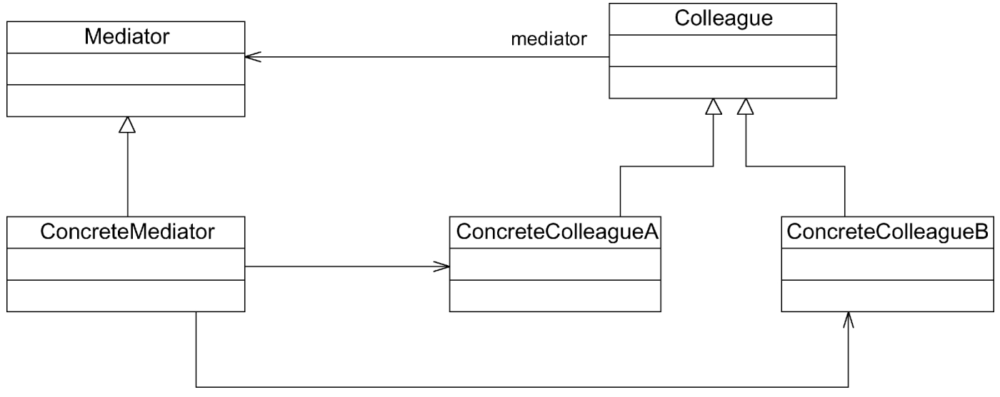

#### **中介者模式：**

##### 1、概述

用一个中介对象（中介者）来封装一系列的对象交互。中介者使各对象不需要显式地相互引用，从而使其耦合松散，而且可以独立地改变它们之间的交互。中介者模式又称为调停者模式。

##### 2、适用性

a、系统中对象之间存在复杂的引用关系，系统结构混乱且难以理解。
b、一个对象由于引用了其他很多对象并且直接和这些对象通信，导致难以复用该对象。
c、为遍历不同的聚合结构提供一个统一的接口，在该接口的实现类中为不同的聚合结构提供不同的遍历方式，而客户端可以一致性地操作该接口。

##### 3、参与者

a、Mediator（抽象中介者）：它定义一个接口，该接口用于与各同事对象之间进行通信。
b、ConcreteMediator（具体中介者）：它是抽象中介者的子类，通过协调各个同事对象来实现协作行为，维持了对各个同事对象的引用。
c、想通过一个中间类来封装多个类中的行为，而又不想生成太多的子类。可以通过引入中介者类来实现，在中介者中定义对象交互的公共行为，如果需要改变行为则可以增加新的具体中介者类。

