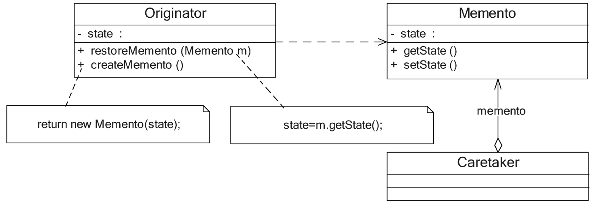

#### **备忘录模式：**

##### 1、概述

在不破坏封装的前提下，捕获一个对象的内部状态，并在该对象之外保存这个状态，这样可以在以后将对象恢复到原先保存的状态。

##### 2、适用性

a、保存一个对象在某一个时刻的全部状态或部分状态，这样以后需要时就能够恢复到先前的状态，实现撤销操作。
b、防止外界对象破坏一个对象历史状态的封装性，避免将对象历史状态的实现细节暴露给外界对象。

##### 3、参与者

a、Originator（原发器）：它是一个普通类，可以创建一个备忘录，并存储其当前内部状态，也可以使用备忘录来恢复其内部状态。一般将需要保存内部状态的类设计为原发器。
b、Memento（备忘录）：存储原发器的内部状态，根据原发器来决定保存哪些内部状态。备忘录的设计一般可以参考原发器的设计，根据实际需要确定备忘录类中的属性。
c、Caretaker（负责人）：负责人又称为管理者，他负责保存备忘录，但是不能对备忘录的内容进行操作或检查。在负责人类中可以存储一个或多个备忘录对象，他只负责存储对象，而不能修改对象，也无须知道对象的实现细节。

