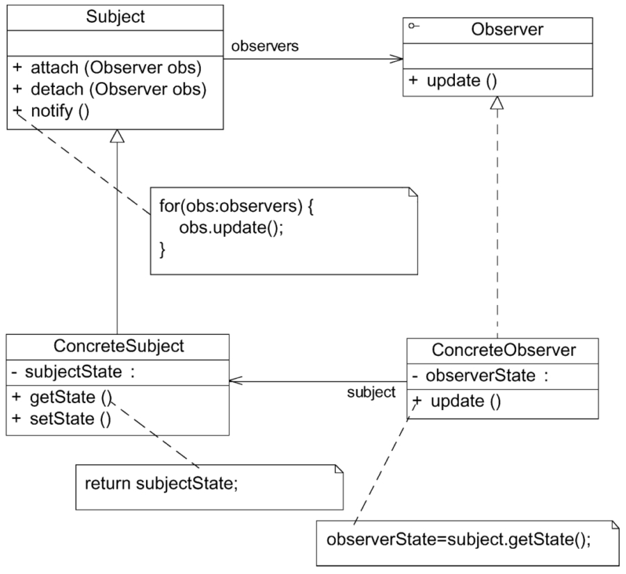

#### **观察者模式：**

##### 1、概述

定义对象之间的一种一对多依赖关系，使得每当一个对象状态发生改变时，其相关依赖对象皆得到通知并被自动更新。观察者模式的别名包括发布-订阅（Publish/Subscribe）模式、模型-视图（Model/View）模式、源-监听器（Source/Listener）模式或从属者（Dependents）模式。

##### 2、适用性

a、一个抽象模型有两个方面，其中一个方面依赖于另一个方面，将这两个方面封装在独立的对象中使它们可以各自独立地改变和复用。
b、一个对象的改变将导致一个或多个其他对象也发生改变，而并不知道具体有多少对象将发生改变，也不知道这些对象是谁。
c、需要在系统中创建一个触发链，A对象的行为将影响B对象，B对象的行为将影响C对象……可以使用观察者模式创建一种链式触发机制。

##### 3、参与者

a、Subject（目标）：目标又称为主题，它是指被观察的对象。在目标中定义了一个观察者集合，一个观察目标可以接受任意数量的观察者来观察，它提供一系列方法来增加和删除观察者对象，同时定义了通知方法notify（）。目标类可以是接口，也可以是抽象类或具体类。
b、ConcreteSubject（具体目标）：具体目标是目标类的子类，通常包含有经常发生改变的数据。当它的状态发生改变时，向其各个观察者发出通知。同时它还实现了在目标类中定义的抽象业务逻辑方法（如果有）。如果无须扩展目标类，则具体目标类可以省略。
c、Observer（观察者）：观察者将对观察目标的改变做出反应。观察者一般定义为接口，该接口声明了更新数据的方法update（），因此又称为抽象观察者。
d、ConcreteObserver（具体观察者）：在具体观察者中维护一个指向具体目标对象的引用，它存储具体观察者的有关状态，这些状态需要和具体目标的状态保持一致。

