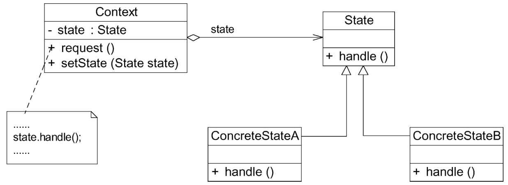

#### **状态模式：**

##### 1、概述

允许一个对象在其内部状态改变时改变它的行为，对象看起来似乎修改了它的类。

##### 2、适用性

a、对象的行为依赖于它的状态（例如某些属性值），状态的改变将导致行为的变化。
b、在代码中包含大量与对象状态有关的条件语句。这些条件语句的出现，会导致代码的可维护性和灵活性变差，不能方便地增加和删除状态，并且导致客户类与类库之间的耦合增强。

##### 3、参与者

a、Context（环境类）：环境类又称为上下文类，它是拥有多种状态的对象。
b、State（抽象状态类）：它用于定义一个接口以封装与环境类的一个特定状态相关的行为。在抽象状态类中声明各种不同状态对应的方法，而在其子类中实现这些方法。
c、ConcreteState（具体状态类）：它是抽象状态类的子类，每个子类实现一个与环境类的一个状态相关的行为。

