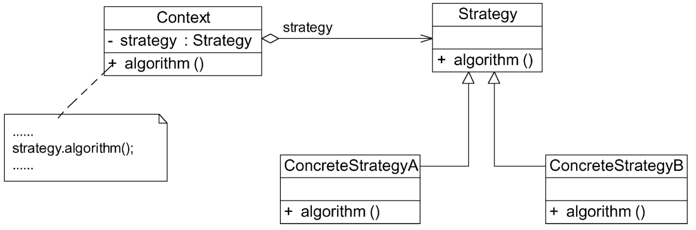

#### **策略模式：**

##### 1、概述

定义一系列算法类，将每一个算法封装起来，并让它们可以相互替换。策略模式让算法独立于使用它的客户而变化，也称为政策模式（Policy）。

##### 2、适用性

a、一个系统需要动态地在几种算法中选择一种。
b、一个对象有很多的行为，使用策略模式，把这些行为转移到相应的具体策略类里面，就可以避免使用难以维护的多重条件选择语句。
c、使用策略模式，把这些行为转移到相应的具体策略类里面，就可以避免使用难以维护的多重条件选择语句。

##### 3、参与者

a、Context（环境类）：环境类是使用算法的角色，它在解决某个问题（即实现某个方法）时可以采用多种策略。
b、Strategy（抽象策略类）：它为所支持的算法声明了抽象方法，是所有策略类的父类。它可以是抽象类或具体类，也可以是接口。环境类通过抽象策略类中声明的方法在运行时调用具体策略类中实现的算法。
c、（3）ConcreteStrategy（具体策略类）：它实现了在抽象策略类中声明的算法。在运行时，具体策略类将覆盖在环境类中定义的抽象策略类对象，使用一种具体的算法实现某个业务处理。

