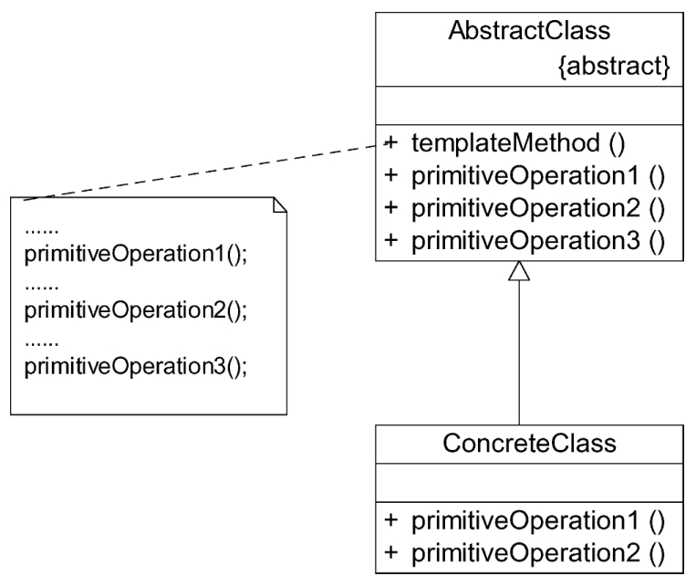

#### **模板方法模式：**

##### 1、概述

定义一个操作中算法的框架，而将一些步骤延迟到子类中。模板方法模式使得子类可以不改变一个算法的结构即可重定义该算法的某些特定步骤。

##### 2、适用性

a、对一些复杂的算法进行分割，将其算法中固定不变的部分设计为模板方法和父类具体方法，而一些可以改变的细节由其子类来实现。即一次性地实现一个算法的不变部分，并将可变的行为留给子类来实现。
b、各子类中公共的行为应被提取出来并集中到一个公共父类中以避免代码重复。
c、需要通过子类来决定父类算法中某个步骤是否执行，实现子类对父类的反向控制。

##### 3、参与者

a、AbstractClass（抽象类）：在抽象类中定义了一系列基本操作（Primitive Operations），这些基本操作可以是具体的，也可以是抽象的。每个基本操作对应算法的一个步骤，在其子类中可以重定义或实现这些步骤。同时，在抽象类中实现了一个模板方法（Template Method），用于定义一个算法的框架。模板方法不仅可以调用在抽象类中实现的基本方法，也可以调用在抽象类的子类中实现的基本方法，还可以调用其他对象中的方法。
b、ConcreteClass（具体子类）：它是抽象类的子类，用于实现在父类中声明的抽象基本操作以完成子类特定算法的步骤，也可以覆盖在父类中已经实现的具体基本操作。

